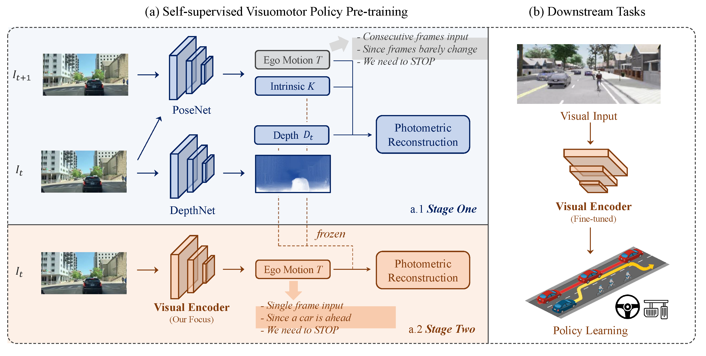

# 🔥 PPGeo with Vehicle Test by Sky-Lab
> [!NOTE]
> **🙏 Acknowledgment: This work is based on the PPGeo (Policy Pre-training for Autonomous Driving via Self-supervised Geometric Modeling) by [Opendrivelab](https://opendrivelab.com/#news).**


> [!IMPORTANT]
> **🎯 You need to build and activate the PPGeo environment first by following instructions in [PPGeo](https://github.com/OpenDriveLab/PPGeo)**
> 
> **If you are on Windows, you can use ```environment_win.yml``` in this repositery**


## 💾 Download Pre-trained Model and Image
| File | Google Drive Link | 
|:--------------:|:--------:|
| Ckpt_with_Nuscenes | [ckpt](https://drive.google.com/file/d/1TXVZeLg6hE28cFmUydzKVQ97zQ5os4wy/view?usp=sharing) | 
| Ckpt_with_MadisonData | [ckpt](https://drive.google.com/file/d/1K2WFvMAh1wS8O-a7t75qsyGDR5HylMod/view?usp=sharing) | 
| IMG_1 | [img](https://drive.google.com/drive/folders/12P4LmQVzkY5cPiX4kGSmnrCAum4PRDho?usp=sharing) |
| IMG_2 | [img](https://drive.google.com/drive/folders/1WccVQg8RfPLeEOuty37mtaTqMruJannp?usp=sharing) |
| IMG_3 | [img](https://drive.google.com/drive/folders/1ajzDKlwih0YWdzy9_NbiJPu-krFgk1kt?usp=sharing) |
| IMG_4 | [img](https://drive.google.com/drive/folders/1ZX381DX8kpQMbpu4sB6lo8OwfRZ7AHUH?usp=sharing) |


## 🚀Get Started

- **1. Put files in the assigned locations:**
  - Ckpt_with_Nuscenes (```best_epoch=04-val_loss_l2=3.128.ckpt```) into ```../nuscenes_planning/log/exp_stage/```
  - Ckpt_with_MadisonData (```best_epoch=37-val_loss_l2=0.038.ckpt```) into ```../nuscenes_planning/log/ppgeo100702/```
  - IMG_1~4 (```img_madison_1~4```) into ```../nuscenes_planning```

- **2. Run ```main.py```:**
```
cd nuscenes_planning
python main.py
```


<div align="center"> 
  
## 🎯The following are the original contents of PPGeo
</div>

***

> [!IMPORTANT]
> 🌟 Stay up to date at [opendrivelab.com](https://opendrivelab.com/#news)!

<div align="center">   
  
# PPGeo: Policy Pre-training for Autonomous Driving via Self-supervised Geometric Modeling
</div>



> Policy Pre-training for Autonomous Driving via Self-supervised Geometric Modeling 
>
> - [Penghao Wu](https://scholar.google.com/citations?user=9mssd5EAAAAJ&hl=en), [Li Chen](https://scholar.google.com/citations?user=ulZxvY0AAAAJ&hl=en&authuser=1), [Hongyang Li](https://lihongyang.info/), [Xiaosong Jia](https://jiaxiaosong1002.github.io/), [Junchi Yan](https://thinklab.sjtu.edu.cn/), [Yu Qiao](http://mmlab.siat.ac.cn/yuqiao/)
> - [arXiv Paper](https://arxiv.org/abs/2301.01006) | [openreview](https://openreview.net/forum?id=X5SUR7g2vVw), ICLR 2023
> - video | [blog](https://zhuanlan.zhihu.com/p/601456429)

This repository contains the pytorch implementation for PPGeo in the paper [Policy Pre-training for Autonomous Driving via Self-supervised Geometric Modeling](https://arxiv.org/abs/2301.01006). PPGeo is a fully self-supervised driving policy pre-training framework to learn from unlabeled driving videos.

## Pre-trained Models

<!---
| [Visual Encoder (ResNet-34)](https://drive.google.com/file/d/1GAeLgT3Bd_koN9bRPDU1ksMpMlWfGXbE/view?usp=sharing) | [DepthNet](https://drive.google.com/file/d/1bzRVs97KbPtfXE-1Iwe60bUD4i0JXxhh/view?usp=sharing) | [PoseNet](https://drive.google.com/file/d/1sDeuJIvfC01NFyuLFyPI3-yihQRsmLY_/view?usp=sharing) |
|:--------------:|:--------:|:-------:|
--->

| Model | Google Drive Link | BaiduYun Link |
|:--------------:|:--------:|:--------:|
| Visual Encoder (ResNet-34) | [ckpt](https://drive.google.com/file/d/1GAeLgT3Bd_koN9bRPDU1ksMpMlWfGXbE/view?usp=sharing) |  [ckpt](https://pan.baidu.com/s/1Fk4czTk68d4nXFcwoqTvqg) (code: itqi) | 
| DepthNet | [ckpt](https://drive.google.com/file/d/1bzRVs97KbPtfXE-1Iwe60bUD4i0JXxhh/view?usp=sharing) | [ckpt](https://pan.baidu.com/s/17bWzWhYb9Iofr_4vX6MByw) (code: xvof)
| PoseNet | [ckpt](https://drive.google.com/file/d/1sDeuJIvfC01NFyuLFyPI3-yihQRsmLY_/view?usp=sharing) | [ckpt](https://pan.baidu.com/s/1R2JBweG-PwX5fJ55WGvLBg) (code: fp2n) |


## Get Started

- Clone the repo and build the environment.

```
git clone https://github.com/OpenDriveLab/PPGeo.git
cd PPGeo
conda env create -f environment.yml --name PPGeo
conda activate PPGeo
```

- Download the driving video dataset based on the instructions in [ACO](https://github.com/metadriverse/ACO).

- Make a symlink to the dataset root.

```
ln -s DATA_ROOT data
```

- Preprocess the data.

```
python ytb_data_preprocess.py
```

## Training

- First stage training.

```
python train.py --id ppgeo_stage1_log --stage 1 --epochs 30
```

- Second stage training.

```
python train.py --id ppgeo_stage2_log --stage 2 --epochs 20 --ckpt PATH_TO_STAGE1_CKPT
```

## Downstream Tasks

### Nuscenes Planning
- Please download the [nuScenes](https://www.nuscenes.org/) dataset first
- Make a symlink to the nuScenes dataset root.
```
cd nuscenes_planning
cd data
ln -s nuScenes_data_root nuscenes
cd ..
```
- Training the planning model
```
python train_planning.py --pretrained_ckpt PATH_TO_STAGE2_CKPT
```
### Navigation & Navigation Dynamic & Reinforcement Learning
We use the [DI-drive](https://github.com/opendilab/DI-drive) engine for IL data collection, IL training, IL evaluation, and PPO training following [ACO](https://github.com/metadriverse/ACO) with carla version 0.9.9.4. Some additional details can be found [here](https://github.com/metadriverse/ACO/issues/1#issuecomment-1210088428).
### 

### Leaderboard Town05-long
We use the [TCP](https://github.com/OpenPerceptionX/TCP) codebase for training and evaluation with default setting. 

## Citation

If you find our repo or our paper useful, please use the following citation:

```bibtex
  @inproceedings{wu2023PPGeo,
    title={Policy Pre-training for Autonomous Driving via Self-supervised Geometric Modeling},
    author={Penghao Wu and Li Chen and Hongyang Li and Xiaosong Jia and Junchi Yan and Yu Qiao},
    booktitle={International Conference on Learning Representations},
    year={2023}
  }
```

## License
All code within this repository is under [Apache License 2.0](https://www.apache.org/licenses/LICENSE-2.0).

## Acknowlegement
Our code is based on [monodepth2](https://github.com/nianticlabs/monodepth2).

